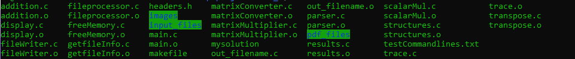
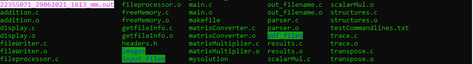

## About The Project
2019 Semester 2 | High Performance Computing | Project 1 (Individual)  

Operations on matrices such as addition, multiplication, transposing and calculating trace  are carried out using OpenMP parallelisation.  

### Built With  
* [C](https://en.wikipedia.org/wiki/C_(programming_language))
* [Open-MPI (Messaging Passing Interface)](https://www.open-mpi.org/)

### How to compile and run 
```$ ls```


```$ make```


```$ ls```


```Examples:```
```
./mysolution --mm -f <path_to_input_file1> <path_to_input_file2>    
./mysolution --sm 2.0 -f <path_to_input_file> -l -t 4  
./mysolution --tr -f <path_to_input_file> -l -t 4  
./mysolution --ad -f <path_to_input_file1> <path_to_input_file2> -l -t 4  
./mysolution --ts -f <path_to_input_file> -l -t 4   
```   
```$ ./mysolution --mm -f ./input_files/float1.in ./input_files/float2.in```


```$ ls```


### Authors
* V.S. Mang (22355071)
